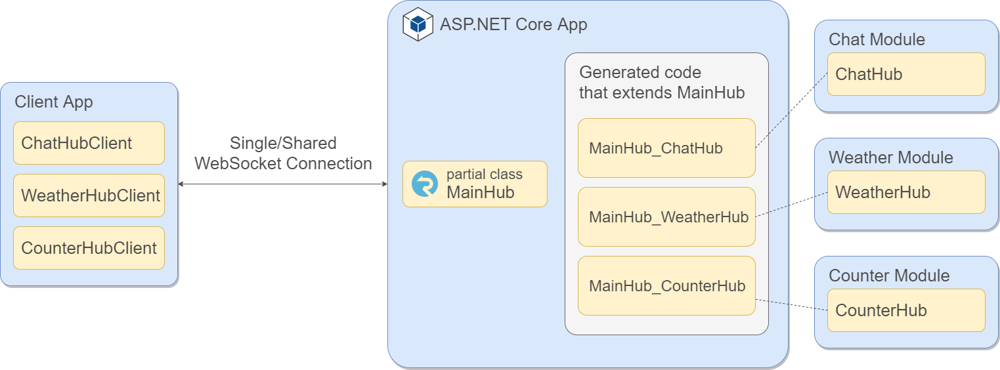

# SignalR.Modules

This sample shows how to build SignalR modules with a shared connection using a C# Source Generator.

The concept is based on the idea of organizing multiple hub methods in partial classes within the same project.
But instead of putting everything in one project, SignalR modules can live in separate projects or NuGet packages.
The partial classes get then generated using a C# Source Generator.

This is an overview of how it works:


## Create a module hub

To create a module hub, a reference to the SignalR.Modules project is needed. Then create a hub class as you would do with regular SignalR, but instead of `Hub` (or `Hub<T>`) use `ModuleHub` (or `ModuleHub<T>`) as base class.

```csharp
public class ChatHub : ModuleHub
{
    public async Task SendMessage(string user, string message)
    {
        await Clients.All.SendAsync("ReceiveMessage", user, message);
    }
}
```

## Use a module hub

To use the module hub, create an ASP.NET Core project and add a reference to `SignalR.Modules` and `SignalR.Modules.Generator`.

```xml
<ProjectReference
    Include="..\..SignalR.Modules.Generator\SignalR.Modules.Generator.csproj"
    OutputItemType="Analyzer"
    ReferenceOutputAssembly="false" />
 
<ProjectReference
    Include="..\..SignalR.Modules\SignalR.Modules.csproj" />
```

Then add an SignalR entry hub that will be used by all module hubs.

```csharp
[SignalRModuleHub(typeof(ChatHub))]
[SignalRModuleHub(typeof(WeatherHub))]
[SignalRModuleHub(typeof(CounterHub))]
public partial class MainHub : ModulesEntryHub
{
}
```

The `ModulesEntryHub` derives from `Hub` and provides some helper methods to initialize the module hubs. We will see it later in the generated code.

The last step is to register all services and add an endpoint for the hub. I added an extension method that registers all module hubs that are added via the attribute.

```csharp
services.AddSignalRModules<MainHub>();
```

```csharp
app.UseEndpoints(endpoints =>
{
    endpoints.MapHub<MainHub>("/hub");
    // ...
});
```

## Strongly typed module hubs

SignalR allows us to define [strongly typed hubs](https://docs.microsoft.com/en-us/aspnet/core/signalr/hubs?view=aspnetcore-5.0#strongly-typed-hubs) to avoid using magic strings. And you can do the same with SignalR modules by using `ModuleHub<T>`.

```csharp
public interface IWeatherClient
{
    public Task ReceiveWeatherUpdate(IEnumerable<WeatherForecast> weatherForecast);
}
```

```csharp
public class WeatherHub : ModuleHub<IWeatherClient>
{
    // ...
}
```

## Send messages from outside a hub
As you can [do it with regular SignalR hubs](https://docs.microsoft.com/en-us/aspnet/core/signalr/hubcontext?view=aspnetcore-5.0), you can send messages from outside a module hub as well. Instead of injecting `IHubContext<T>` you can inject `IModuleHubContext<T>`.

```csharp
public class ChatController : ControllerBase
{
    private readonly IModuleHubContext<ChatHub> _hubContext;
 
    public ChatController(IModuleHubContext<ChatHub> hubContext)
    {
        _hubContext = hubContext;
    }
 
    [HttpGet]
    public ActionResult SendMessage(string user, string message)
    {
        _hubContext.Clients.All.SendAsync("ReceiveMessage", user, message);
        return Ok();
    }
}
```

When you have a strongly typed module hub, you can use `IModuleHubContext<WeatherHub, IWeatherClient>`.

## Using the ModuleHubClient

You can connect to the hub and start sending messages the same way as with any SignalR hub.  
Optionally, you can use the `ModuleHubClient` class. It allows sharing the connection, prefixes all method names with the module hub name, and unsubscribes all handlers when it gets disposed.
To use it, create a client class per module hub that derives from the `ModuleHubClient`. For the `ChatHub` it’s just an empty class, but you could put more logic in it (see the `WeatherHubClient`).

```csharp
public class ChatHubClient : ModuleHubClient
{
}
```

Then add the clients to the service collection:

```csharp
builder.Services.AddSignalRModules("MainHub", sp => sp.GetRequiredService<NavigationManager>().ToAbsoluteUri("/hub"))
    .AddModuleHubClient<ChatHubClient>()
    .AddModuleHubClient<WeatherHubClient>()
    .AddModuleHubClient<SignalRCounter>("CounterHub");
```

The `AddSignalRModules` method takes the name of the entry hub as the first parameter. The name is used internally as a key to share the connection. The second parameter can be the URL of the hub or an action to configure the SignalR `IHubConnectionBuilder`.

Then use `AddModuleHubClient` to add all the module hub clients that use the same entry hub. Per convention, the class name (without the Client suffix) is used to prefix all method names. Alternatively, it’s possible to pass the name as a parameter. By default, all clients get added as scoped services, but it’s possible to specify the `ServiceLifetime`.
